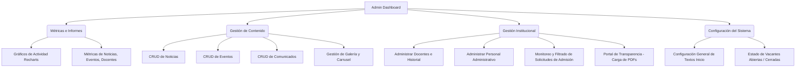

# 🏫 Portal Web Institucional & Panel Administrativo — Colegio Bandera del Perú

¡Bienvenido al repositorio oficial del **Portal Web Institucional y Sistema de Gestión del Colegio Bandera del Perú**! Este es un ecosistema full-stack de última generación, diseñado para conectar de manera fluida y dinámica a la comunidad educativa (padres, alumnos, docentes) con las autoridades del plantel, contando con una interfaz de usuario premium, moderna y responsiva, acoplada a un robusto panel de administración.

Este proyecto ha sido desarrollado bajo los más altos estándares de desarrollo web moderno: una experiencia fluida enriquecida con animaciones sutiles, un **Modo Oscuro Premium ("Midnight")** integrado a nivel de arquitectura, optimización de velocidad de carga, y un sólido sistema de seguridad en el backend.

---

## 📌 Índice de Contenidos
1. [🌟 Características Destacadas](#-características-destacadas)
2. [🛠️ Arquitectura y Tecnologías](#️-arquitectura-y-tecnologías)
3. [📂 Estructura General del Proyecto](#-estructura-general-del-proyecto)
4. [💻 Portal Público: Módulos y Funcionalidades](#-portal-público-módulos-y-funcionalidades)
5. [🔐 Panel de Administración: Control Total en Tiempo Real](#-panel-de-administración-control-total-en-tiempo-real)
6. [📊 Modelo y Esquema de Base de Datos (MySQL)](#-modelo-y-esquema-de-base-de-datos-mysql)
7. [🛡️ Seguridad y Buenas Prácticas Backend](#️-seguridad-y-buenas-prácticas-backend)
8. [⚡ Rendimiento y Optimizaciones Frontend](#-rendimiento-y-optimizaciones-frontend)
9. [🚀 Guía de Instalación y Despliegue](#-guía-de-instalación-y-despliegue)

---

## 🌟 Características Destacadas

*   **Experiencia Visual Premium (Dark/Light)**: Sistema dinámico con una paleta de colores curada y de alta accesibilidad. El tema oscuro de tipo *"Midnight"* utiliza azules profundos y grises oscuros premium para evitar el cansancio visual, con sincronización de estado instantánea en la carga de página (previniendo el molesto "flash" de luz blanca).
*   **Monitoreo y Métricas en Tiempo Real**: Panel de control con contadores automáticos para todos los recursos institucionales y gráficos interactivos alimentados directamente de la base de datos.
*   **CMS Dinámico Completo**: Carga, actualización y eliminación de noticias, comunicados urgentes, eventos del calendario, galería de fotos, plana docente y administrativa de manera dinámica desde el navegador sin tocar una sola línea de código.
*   **Gestión Integral de Admisiones**: Embudo digital (Formulario de Admisiones) para capturar interesados en tiempo real, almacenado de manera estructurada en el servidor con reportes y visualización directa para los administradores.
*   **Transparencia Institucional**: Sección pública para consulta de documentos oficiales clasificados (PEI, RI, PCI, PAT) mediante visualización directa de archivos PDF estructurados.

---

## 🛠️ Arquitectura y Tecnologías

El sistema está construido sobre una arquitectura desacoplada **MERN (MySQL, Express, React, Node)**, lo que garantiza escalabilidad y facilidad de mantenimiento:

### 💻 Frontend (Cliente)
*   **React 19**: Biblioteca base para interfaces de usuario declarativas y reactivas.
*   **Vite**: Empaquetador ultra-rápido para un flujo de trabajo optimizado y hot-reloading inmediato.
*   **Tailwind CSS v4 & PostCSS**: Framework de diseño utilitario optimizado para un control estricto de estilos, variables CSS nativas y transiciones fluidas.
*   **React Router DOM 7**: Enrutamiento dinámico SPA (Single Page Application) en el cliente con protección de rutas administrativas.
*   **Recharts**: Gráficos analíticos limpios, interactivos y adaptables al tema claro y oscuro en tiempo real.
*   **SweetAlert2**: Notificaciones elegantes y modales interactivos de confirmación para acciones críticas.
*   **Lucide React**: Set de íconos vectoriales modernos y estilizados.

### ⚙️ Backend (Servidor)
*   **Node.js & Express.js**: Servidor HTTP rápido y minimalista enfocado en APIs RESTful estructuradas.
*   **MySQL & mysql2/promise**: Motor de base de datos relacional robusto que utiliza conexiones en Pool con soporte nativo de promesas (`async/await`) para transacciones eficientes.
*   **JWT (JsonWebToken)**: Sistema estándar de autenticación basado en tokens firmados con caducidad establecida (8 horas) y guardado seguro en cliente.
*   **BcryptJS**: Encriptación unidireccional y hash adaptativo de contraseñas de administrador.
*   **Sharp & Multer**: Procesamiento y optimización de imágenes en el servidor antes del almacenamiento.
*   **Helmet & Express Rate Limit**: Suite de seguridad para cabeceras HTTP y protección automatizada contra ataques de Fuerza Bruta y denegación de servicio (DoS).
*   **Compression & Morgan**: Middleware para compresión Gzip de todas las respuestas HTTP y registrador de auditoría de peticiones en consola de desarrollo.

---

## 📂 Estructura General del Proyecto

El proyecto está diseñado bajo una estructura limpia de monorepo simplificado:

```text
Web_Institucional/
├── backend/                  # Servidor de API REST y Conexión de Base de Datos
│   ├── config/               # Configuraciones del Pool MySQL e Inicialización de Tablas
│   ├── controllers/          # Controladores y Lógica de Negocio por Recurso
│   ├── middleware/           # Filtros de Autenticación, Roles y Manejo de Errores
│   ├── routes/               # Rutas y Endpoints expuestos de la API
│   ├── uploads/              # Carpeta de almacenamiento para imágenes y PDFs subidos
│   ├── index.js              # Archivo de entrada de Express y Configuración Global
│   └── package.json          # Dependencias y scripts del servidor
│
├── frontend/                 # Aplicación de React (Vite)
│   ├── public/               # Activos públicos estáticos del portal
│   ├── src/
│   │   ├── assets/           # Logotipos, imágenes y recursos visuales base
│   │   ├── components/       # Componentes reusables (Navbar, Footer, Gráficos)
│   │   ├── context/          # Estados globales (Autenticación y Tema Oscuro/Claro)
│   │   ├── pages/            # Páginas públicas y Módulos de Administración
│   │   ├── routes/           # Rutas del Frontend y Subrutas de Administración
│   │   ├── services/         # Cliente Axios centralizado y llamadas a endpoints
│   │   ├── App.jsx           # Componente Raíz de Enrutamiento y Proveedores de Contexto
│   │   └── main.jsx          # Punto de entrada de React en el DOM
│   ├── tailwind.config.js    # Definición de tokens de diseño y colores Midnight
│   └── package.json          # Dependencias del cliente
```

---

## 💻 Portal Público: Módulos y Funcionalidades

### 1. Inicio (Página de Aterrizaje)
*   **Carrusel de Imágenes Dinámico**: Banner principal configurable en orden y contenido por el administrador con soporte para títulos llamativos y subtítulos estilizados.
*   **Cifras de Impacto**: Sección de logros institucionales con contadores interactivos (ejemplo: años de experiencia, alumnos formados, plana de docentes, porcentaje de ingreso o logros).
*   **Pilares Educativos**: Tres bloques de valor destacados (ejemplo: Liderazgo Académico, Valores Sólidos y Visión Global) modificables completamente desde el panel administrativo.
*   **Barra de Estado de Sesión**: Si un administrador está navegando por la web pública, se muestra una discreta barra superior que le permite regresar al panel administrativo con un solo clic.

### 2. Sección "Nuestro Colegio" (Institucional)
Utiliza un componente unificado `SeccionInstitucion.jsx` altamente optimizado que renderiza dinámicamente diferentes secciones mediante menús de navegación laterales:
*   *Nosotros / Historia*: Reseña histórica y trayectoria del plantel.
*   *Organigrama / Directivos*: Plana directiva, jerarquías y estructura de toma de decisiones.
*   *Misión, Visión y Valores*: Cimientos éticos y de formación de la institución.
*   *Propuesta Educativa & Talleres*: Actividades extracurriculares (deportes, danza, música, robótica).
*   *TIC (Tecnologías de Información)*: Secciones dedicadas a Aula Virtual, Recursos Tecnológicos, Proyectos de Innovación y Soporte Técnico.

### 3. Noticias e Información de Actualidad
*   Carga asíncrona de novedades institucionales organizadas cronológicamente.
*   Tarjetas con imagen, fecha de publicación, títulos de impacto y cuerpos de lectura extensivos.
*   Ideal para mantener a los padres de familia al tanto de los logros y actividades del colegio.

### 4. Calendario y Listado de Eventos
*   Estructura en tarjetas informativas que detallan:
    *   **Fecha y Hora** del evento escolar.
    *   **Lugar** físico o plataforma virtual.
    *   **Descripción** detallada con imágenes informativas asociadas.

### 5. Comunicados Oficiales para la Comunidad
*   Panel interactivo diseñado específicamente para la comunicación directa con padres y estudiantes.
*   Filtros interactivos por tipo de comunicado: **Urgente**, **Académico**, **Administrativo**, **General**.
*   Facilita la visualización inmediata de avisos importantes.

### 6. Admisión y Captación Escolar
*   Formulario interactivo y amigable para la recolección de postulaciones de matrículas.
*   Los campos requeridos son: **Nombre del Padre/Madre**, **Nombre del Estudiante**, **Grado de Interés** y **Celular de Contacto**.
*   Validaciones instantáneas y conexión directa con la base de datos de administración de leads.

### 7. Transparencia y Documentos Legales
*   Sección oficial donde se alojan los documentos y reportes del colegio que exige la ley.
*   Buscador interactivo y descargas directas en PDF del Proyecto Educativo Institucional (PEI), Reglamento Interno (RI), Plan Anual de Trabajo (PAT), etc.

### 8. Personal Docente y Administrativo
*   Visualización tipo mosaico de la plana del colegio, dividida en **Plana Docente** y **Plana Administrativa**.
*   Muestra fotos de perfil, nombres completos, áreas de enseñanza y cargos de soporte, organizados dinámicamente según un orden jerárquico establecido por el administrador.

---

## 🔐 Panel de Administración: Control Total en Tiempo Real

El corazón administrativo (`/admin/*`) requiere inicio de sesión obligatorio con privilegios de rol. Proporciona una interfaz tipo Dashboard integral que no interfiere visualmente con el sitio público.



### Detalle de Módulos de Administración:

1.  **Dashboard General**: Visualiza tarjetas analíticas rápidas con las cantidades totales de recursos y gráficos interactivos con líneas de tendencia y áreas que analizan la frecuencia de actividades publicadas.
2.  **Gestión de Noticias**: Editor completo para redactar novedades, subir imágenes representativas y eliminarlas.
3.  **Gestión de Eventos**: Agenda interactiva para registrar fechas y lugares de futuras reuniones, asambleas de padres de familia o celebraciones cívicas.
4.  **Gestión de Comunicados**: Categorizador dinámico de comunicados oficiales.
5.  **Gestión de Admisiones**: Listado centralizado de todas las solicitudes de contacto dejadas por los padres. Permite a la secretaría del colegio revisar nombres, celulares y grados de interés para el seguimiento de la matrícula.
6.  **Gestión de Transparencia**: Formulario de carga de documentos institucionales. Asigna título, descripción, categoría y link al archivo PDF correspondiente.
7.  **Docentes & Administrativos**: Panel para añadir y dar de baja al staff institucional. Permite especificar su prioridad numérica (`orden`) para determinar quién aparece primero en la web (ejemplo: Directores, Coordinadores, Profesores).
8.  **Gestión de Carrusel**: Control directo de los banners principales de la página de inicio para campañas promocionales.
9.  **Personalización de Inicio**: Permite cambiar los títulos gigantes de bienvenida, el subtítulo institucional, las estadísticas clave y la descripción de los tres pilares institucionales con un solo botón de guardado.

---

## 📊 Modelo y Esquema de Base de Datos (MySQL)

El backend cuenta con un script de autoverificación y creación de esquemas (`initDb.js`) que asegura las tablas necesarias en el arranque de la aplicación.

### 📋 Detalle de Tablas y Atributos:

#### 1. Tabla: `usuarios` (Control de Credenciales)
| Campo | Tipo | Restricción | Descripción |
| :--- | :--- | :--- | :--- |
| `id` | INT | AUTO_INCREMENT, PK | Identificador único del usuario |
| `username` | VARCHAR(255) | NOT NULL, UNIQUE | Nombre de usuario para login |
| `password` | VARCHAR(255) | NOT NULL | Hash seguro de la contraseña |
| `rol` | ENUM('admin', 'user') | DEFAULT 'user' | Nivel de permisos de acceso |
| `created_at` | TIMESTAMP | DEFAULT CURRENT_TIMESTAMP | Fecha de creación del registro |

#### 2. Tabla: `noticias` (CMS Novedades)
| Campo | Tipo | Restricción | Descripción |
| :--- | :--- | :--- | :--- |
| `id` | INT | AUTO_INCREMENT, PK | Identificador único |
| `titulo` | VARCHAR(255) | NOT NULL | Título principal de la noticia |
| `contenido` | TEXT | NOT NULL | Cuerpo completo de la noticia |
| `fecha` | DATETIME | DEFAULT CURRENT_TIMESTAMP | Fecha asignada a la noticia |
| `imagen` | VARCHAR(255) | Opcional | URL o ruta local de la imagen |

#### 3. Tabla: `eventos` (Calendario de Actividades)
| Campo | Tipo | Restricción | Descripción |
| :--- | :--- | :--- | :--- |
| `id` | INT | AUTO_INCREMENT, PK | Identificador único |
| `titulo` | VARCHAR(255) | NOT NULL | Nombre del evento escolar |
| `descripcion` | TEXT | Opcional | Detalles de la agenda |
| `fecha_evento` | DATE | NOT NULL | Fecha en la que ocurrirá |
| `hora_evento` | TIME | Opcional | Hora de inicio |
| `lugar` | VARCHAR(255) | Opcional | Ubicación o link de videoconferencia |
| `imagen_url` | VARCHAR(255) | Opcional | Afiche o banner del evento |

#### 4. Tabla: `comunicados` (Avisos Escolares)
| Campo | Tipo | Restricción | Descripción |
| :--- | :--- | :--- | :--- |
| `id` | INT | AUTO_INCREMENT, PK | Identificador único |
| `titulo` | VARCHAR(255) | NOT NULL | Título del comunicado |
| `descripcion` | TEXT | NOT NULL | Cuerpo del aviso oficial |
| `fecha` | DATETIME | DEFAULT CURRENT_TIMESTAMP | Fecha de publicación |
| `tipo` | VARCHAR(50) | NOT NULL | Categoría (Urgente, Académico, etc) |

#### 5. Tabla: `admisiones` (Captación de Alumnos / Leads)
| Campo | Tipo | Restricción | Descripción |
| :--- | :--- | :--- | :--- |
| `id` | INT | AUTO_INCREMENT, PK | Identificador único |
| `nombre_padre` | VARCHAR(255) | NOT NULL | Nombre del apoderado solicitante |
| `nombre_estudiante`| VARCHAR(255) | NOT NULL | Nombre del futuro estudiante |
| `grado_interes` | VARCHAR(100) | NOT NULL | Grado escolar al que postula |
| `celular` | VARCHAR(20) | NOT NULL | Celular de contacto para seguimiento |
| `fecha_registro` | TIMESTAMP | DEFAULT CURRENT_TIMESTAMP | Fecha de envío del formulario |

#### 6. Tabla: `transparencia` (Portal de Archivos Públicos)
| Campo | Tipo | Restricción | Descripción |
| :--- | :--- | :--- | :--- |
| `id` | INT | AUTO_INCREMENT, PK | Identificador único |
| `titulo` | VARCHAR(255) | NOT NULL | Nombre del documento institucional |
| `descripcion` | TEXT | Opcional | Resumen del contenido |
| `archivo_pdf` | VARCHAR(255) | NOT NULL | URL o ruta de almacenamiento del PDF |
| `categoria` | VARCHAR(100) | NOT NULL | Clasificación (ej: PEI, RI, Presupuesto) |
| `fecha` | TIMESTAMP | DEFAULT CURRENT_TIMESTAMP | Fecha de carga del reporte |

#### 7. Tabla: `configuracion` (Variables Globales dinámicas)
| Campo | Tipo | Restricción | Descripción |
| :--- | :--- | :--- | :--- |
| `clave` | VARCHAR(191) | PRIMARY KEY | Identificador único de la propiedad |
| `valor` | TEXT | Opcional | Valor almacenado en formato texto plano |
| `updated_at` | DATETIME | DEFAULT CURRENT_TIMESTAMP | Fecha de última modificación |

*Nota: Esta tabla utiliza la query optimizada `INSERT ... ON DUPLICATE KEY UPDATE` para permitir modificaciones seguras en caliente de variables del frontend.*

---

## 🛡️ Seguridad y Buenas Prácticas Backend

La seguridad de los datos de la institución y el blindaje del servidor han sido prioridades clave en el desarrollo de la API:

1.  **Protección de Rutas**: Todas las rutas de escritura, edición y eliminación de datos (`POST`, `PUT`, `DELETE`) en el backend están resguardadas por el middleware `verificarToken` y `soloAdmin`.
2.  **Helmet (Seguridad de Cabeceras HTTP)**: Express incluye protección nativa contra vulnerabilidades comunes de la web, bloqueando inyecciones XSS, Clickjacking y ataques de suplantación de identidad mediante la gestión estricta de políticas de carga de recursos (`crossOriginResourcePolicy`).
3.  **Express Rate Limit (Antifuerza Bruta y DoS)**: Las IPs de los clientes se analizan constantemente. Se ha establecido un límite de **200 solicitudes por cada 15 minutos** para APIs públicas, previniendo sobrecargas intencionales de servidores o escaneo automatizado de vulnerabilidades.
4.  **Encriptación Bcrypt**: No se almacenan contraseñas legibles. La contraseña del administrador se codifica con un algoritmo asimétrico de encriptación hash con salt adaptativo de alto rendimiento.
5.  **Pool de Conexiones Reutilizables**: Se implementa un pool dinámico con `connectionLimit: 10`, que recicla conexiones activas de base de datos de manera automática. Esto previene fugas de recursos y el colapso del servicio de base de datos en horas de alto tráfico escolar.

---

## ⚡ Rendimiento y Optimizaciones Frontend

*   **Evitación de Flickeos en el Modo Oscuro**: El color de fondo se lee del `localStorage` e inyecta directamente al nodo `document.documentElement` de manera sincrónica al inicio de la carga del DOM. Esto elimina por completo el parpadeo de pantalla en blanco para usuarios con modo oscuro preferido.
*   **Compresión de Respuestas en Servidor**: El middleware `compression` reduce el peso en bytes de las payloads de datos en formato JSON de la API en hasta un 70%, acelerando de manera sustancial la velocidad de navegación del usuario final.
*   **Gestión Limpia de Peticiones Asíncronas**: Uso de `Promise.allSettled` para cargar estadísticas paralelas en el Dashboard del administrador. Si un recurso falla en base de datos temporalmente, el resto de indicadores e interfaces se cargan de forma independiente sin bloquear la aplicación o mostrar pantallas de error críticas.
*   **Diseño SPA Responsivo**: Enrutamiento optimizado del lado del cliente que evita recargas de página completas al cambiar de sección, logrando una sensación fluida de aplicación nativa.

---

## 🚀 Guía de Instalación y Despliegue

Sigue estos pasos para levantar el entorno de desarrollo local:

### Requisitos Previos:
*   [Node.js](https://nodejs.org/) (Versión 18 o superior recomendada).
*   [MySQL Server](https://www.mysql.com/) en ejecución local o remota.

---

### Paso 1: Configuración del Backend

1.  Accede al directorio del servidor:
    ```bash
    cd backend
    ```
2.  Instala todas las dependencias requeridas:
    ```bash
    npm install
    ```
3.  Crea un archivo `.env` en la raíz de la carpeta `backend` con las siguientes variables básicas:
    ```env
    PORT=3000
    JWT_SECRET=tu_secreto_seguro_para_tokens
    
    # Configuración de Base de Datos
    DB_HOST=localhost
    DB_USER=root
    DB_PASSWORD=tu_contrasena_de_mysql
    DB_NAME=colegio_db
    ```
4.  Asegúrate de que tu servidor MySQL esté encendido y que la base de datos `colegio_db` exista.
5.  Inicia el servidor en modo desarrollo (utiliza `nodemon` para reinicios automáticos ante cambios):
    ```bash
    npm run dev
    ```
    *Nota: En el primer arranque, el script `initDb.js` verificará y creará todas las tablas requeridas de forma automática.*

---

### Paso 2: Configuración del Frontend

1.  Abre una nueva terminal y navega al directorio del cliente:
    ```bash
    cd frontend
    ```
2.  Instala las dependencias del cliente React:
    ```bash
    npm install
    ```
3.  Crea un archivo `.env` en la raíz de la carpeta `frontend` indicando la ruta base de tu servidor de API:
    ```env
    VITE_API_URL=http://localhost:3000/api
    ```
4.  Inicia el servidor de desarrollo de Vite:
    ```bash
    npm run dev
    ```
5.  Abre en tu navegador la dirección provista por la consola (generalmente `http://localhost:5173`) y empieza a explorar.

---

¡Disfruta navegando y expandiendo el sistema web oficial del **Colegio Bandera del Perú**! Si tienes consultas sobre despliegue a producción o extensiones de base de datos, no dudes en consultar los esquemas y la sección de seguridad detallada. 🏫✨
